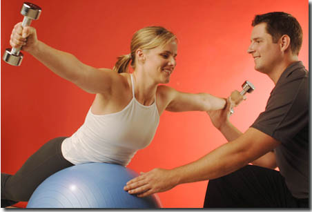

{:.img-responsive}

If your most difficult issue is not having enough time to workout, then this is our most convenient solution. No more excuses of not being able to make it to gym because we'll come out to you. We have over 10 years of experience turning people's homes into gyms and you'll be surprised how little equipment we need to achieve your goals:

**Locations:** shanghai downtown, hongqian ,pudong, and more

TRAINING JUST TO -- '35-60 Minute leanMAXX' High Intensity Training'

35 Minute high intensity training: Don't think you're not going to get a cardiovascular.

Using strength and resistance training, we'll get your heart rate up and down by exercising in 45 second intervals followed by 10 seconds of rest. and with LEON KICKBOXING workout- punch and kick the PADS .Our 35 minute programs provide the most efficient form of exercise with optimal results!

Targeted training for lean muscle development and a supercharged metabolism.
--------------------------------------

MUSCLE CONFUSION NEVER PLATEAU

Here's the true secret of how it works: Muscle Confusion. It uses targeted training phases so your body keeps adapting and growing. You'll never "plateau" - which means your body will never get used to the routines, making improvements slow down or even stop.

Short training cycles constantly challenge your muscles with variety and intensity.It maximizes fat burning and muscle sculpting in different ways every day.
