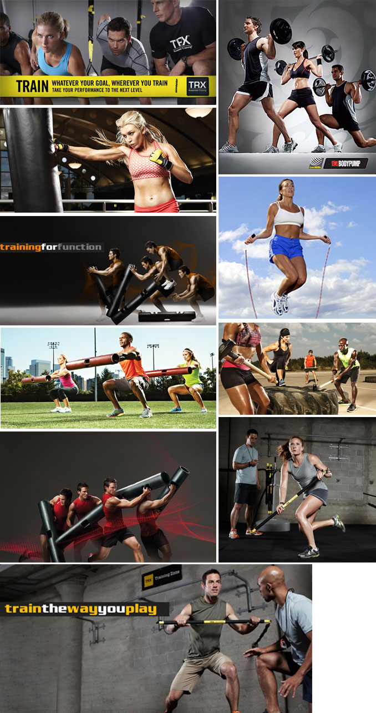
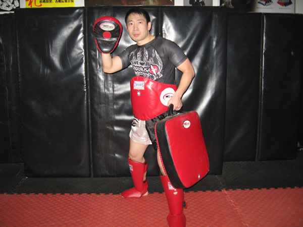

  

  

    

      Leon is founder of Leon personal fitness training,  to assure you of the best possible service. Established in 2003  Leon  Fitness is now recognised as shanghai's foremost mobile personal training company.
    

    <ul>
      <li>EX-china kickboxing(sanshou) champion.</li>
      <li>1999 start personal training in shanghai GOLD'S GYM</li>
      <li>2000-2003 GOLD'S GYM shanghai top personal trainer</li>
      <li>2003 first chinese personal trainer invited by IDEAFIT went to USA </li>atworld personal trainer summit.
      <li>2005-2008 kickboxing, muaythai trainer in (shanghai)FITNESS FIRST club</li>
      <li>2008 the founder of NAVILEON KICKBOXING,MMA &amp; FITNESS</li>
      <li>2008 WILL'S GYM kickboxing progrom design</li>
      <li>EMBASSY CLUB kickboxing trainer</li>
      <li>LONGWU Kungfu shanghai   kickboxing, BJJ, MMA  trainer</li>
      <li>THE PORTMAN RITZ-CARLTON HOTEL  shanghai  health &amp; fitness cpersonal </li>trainer
      <li>2003 start the LEON FITNESS PERSONAL TRAINING(shanghai)</li>
    </ul>
  

  

The Leon Fitness team of fully qualified & experienced trainers offer a range of fitness services designed to complement one another. Our fun & individual approach encourages commitment and success for everybody. Furthermore, our personal & technical customer care ensures you are always the first priority.

### At leon Personal Training (shanghai)  - Your Goals are our Priority

People turn to leon Personal Training (leonPT) when they're looking for more than the typical trainer and nothing less than unrivaled results.

With an unmatchable business model that allows our staff to solely focus on their clients, leon Personal Ttraining continues to be the reliable source for highly professional and knowledgeable personal trainers. Handpicked by leon, our team has been delivering real solutions in real time for over 10 years by applying the latest techniques, methods and research.

We offer private and semi-private training sessions in your home, building exercise room, office or in one of our studios & boxing GYM and our top fitness club in shanghai.

### Did you know...
That IDEA, the International Health and Fitness Assocation, released a statistic that found 75% of people who exercise are not getting the results they want? But out of the 25% of people who are getting results, 90% of them are working with a Personal Trainer.

Private Training at LEON PERSONAL TRAINING is simply the fastest way to the best workout experience you'll ever have.

### Our Fitness Programs

Honest Expectations - Real solutions - Sustainable results.

Our training and nutrition programs are custom designed to help you sculpt a stronger and leaner body that feels as good as it looks. After being assigned to one of our dedicated staff, your program will be tailored based on your needs and our Three Key Elements, which are:

#### 1.Weight Loss - Burn Fat, Build Strength and Lose Inches
Boost Metabolism

Tone Problem Areas

Learn and Apply Healthy Eating and Lifestyle Habits

#### 2.Rehabilitative Fitness - Decrease Your Injury Potential
Enhance Posture

Ease Back and Joint Related Pain

Increase Bone Density

#### 3.Functional Strength - Perform with an Edge in Life
Develop Cardio Endurance

Build Core and Balance Strength

Improve Flexibility and Mobility

We also specialize in guiding you through Preconception, Prenatal, Post-Partum and Menopause.

### Meal Plans
Results start with a smart meal plan. If you're not willing to change your diet, your weight won't be willing to change either. Your trainer will coach you through your diet but if you are looking for more help, we have meal plans to meet every need.

### Free Meal Plans - FREE

These meal plans were created by trainers as recommendations based on your situation.

