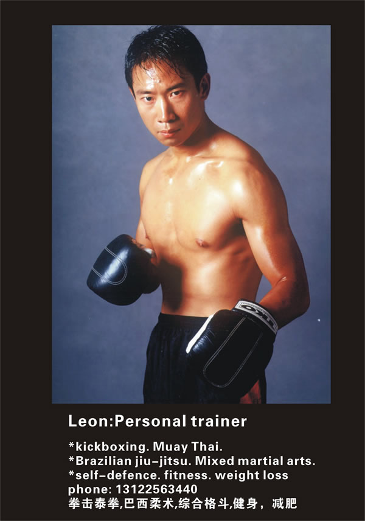

## LEON KICKBOXING & Personal Training

The foundation of The LEON KICKBOXING Workout? is the promise that, in an hour, you will not only have a great workout but you'll feel as exhilarated as if you'd actually stepped into the ring. And the way to get the most out of any LEON KICKBOXING workout is to feel comfortable and confident in every move. Our Private Training sessions quickly teach beginners proper form, getting you comfortable throwing punches, kicks and combinations. And experienced client find that Personal training is the fastest way to hone skills move to the next level. Whatever your training and exercise goals, going one-on-one with our trainers gets you there, now!

## Muay Thai, Kickboxing

LEON Muay Thai class teaches our unique striking system. created This system was developed through years of competition and teaching experience. It combines Western Boxing footwork and punching with traditional Muay Thai ,kickboxing and china sanshou kicks, knees, elbows, and clinch.takedowns .

Class starts with jump rope and footwork-focused shadow box. clients are then partnered up to simulate combat and taught technique and biomechanics. Class ends with strength and conditioning. We believe learning skill in a controlled environment is the best way to encourage learning and avoid injury.
