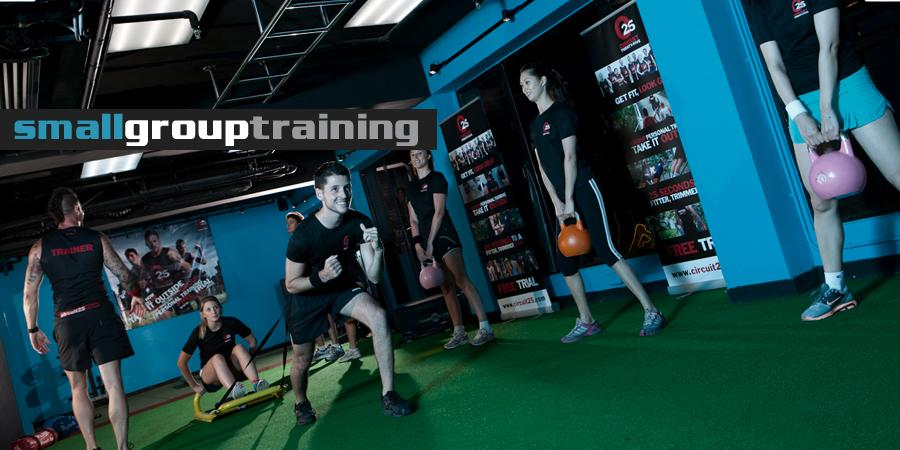
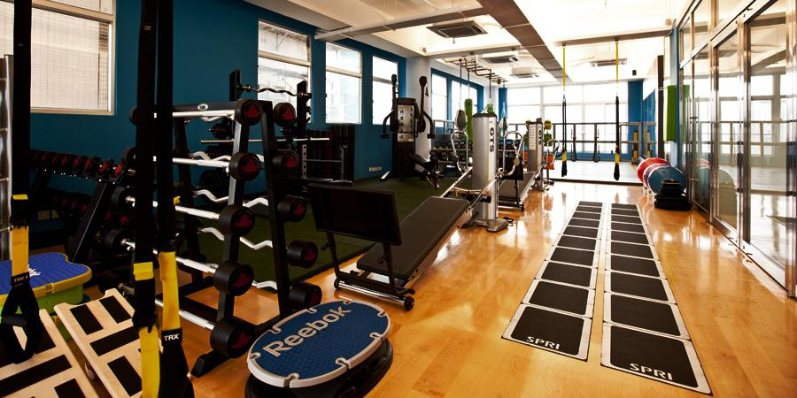

{:.img-responsive}
{:.img-responsive}

- The Portman Ritz-Carlton Hotel Fitness Club
- Embassy Club Fitness Club
- Kerry Centre Fitness Club
- Will's GYM
- Physical Fitness
- In - your home or your home GYM or office
- mob fitness
- baccarat residence 8.shanghai
- lakeville club
- swissotel
- four seasons hotel
- green mountain chateau club
- shangri-la
- portman shanghai center
- tomson-riviera
- IFC residences
- sinan mansions
- 8 park avenue
- one park avenue
- la doll
- windsor park
- top of city
- shimao riviera garden
- central residences
- elegant garden
- french concession
- hong qiao. pudong.
- Leon Kickboxing & Fitness Club (Xin Zha Lu 945, close Tai Xing Lu)

<iframe width="100%" height="350" frameborder="0" scrolling="no" marginheight="0" marginwidth="0" src="http://ditu.google.com/maps?f=q&amp;source=s_q&amp;hl=en&amp;geocode=&amp;q=%E6%96%B0%E9%97%B8%E8%B7%AF945&amp;ie=UTF8&amp;hq=&amp;hnear=Shanghai+Jing'an+Xinzha+Rd+945%E5%8F%B7&amp;ll=31.233802,121.45798&amp;spn=0.006931,0.003728&amp;z=14&amp;iwloc=A&amp;brcurrent=3,0x35b27002cd47a7f1:0x57b3bfb932aaf682,1%3B5,0,0&amp;output=embed"></iframe> <small><a href="http://ditu.google.com/maps?f=q&amp;source=embed&amp;hl=en&amp;geocode=&amp;q=%E6%96%B0%E9%97%B8%E8%B7%AF945&amp;ie=UTF8&amp;hq=&amp;hnear=Shanghai+Jing'an+Xinzha+Rd+945%E5%8F%B7&amp;ll=31.233802,121.45798&amp;spn=0.006931,0.003728&amp;z=14&amp;iwloc=A&amp;brcurrent=3,0x35b27002cd47a7f1:0x57b3bfb932aaf682,1%3B5,0,0" style="color:#0000FF;text-align:left">View Larger Map</a></small>

  
  

    
  

  

  
  

    
  

  

